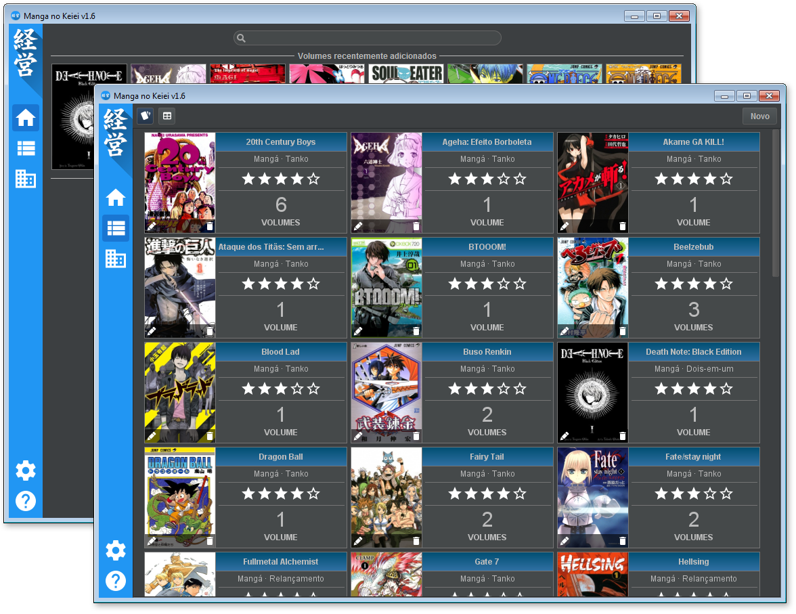

# Manga no Keiei 
Manga no Keiei helps your manga collection management with a GUI, written in Java. It grabs some informations from the MyAnimeList and Manga Cover Database API, so the most of the informations that you should fill, it's filled by their information, however, some parts of the software, like Volumes management, doesn't have some online database with an API available, so you have to fill it manually, but it's the plans to parse this website's HTML. :smile:

## Features
- Search in [MyAnimeList](https://myanimelist.net/) to add new Mangas to the database;
- Download manga covers from [Manga Cover Database](http://mcd.iosphe.re/) when add a new manga volume;
- Easy-to-view interface;
- Support for export your database and open in anywhere;
- Uses SQLite, so you don't need a database server installed in your computer;
- The program doesn't need to be installed, it's portable.

## Running
First, you need to download and install the Java Virtual Machine, that can be downloaded at the [official Java website](https://java.com/download).

If the simple double click in the file don't work, you can run the command above on your terminal ou follow the instructions on the wiki.
    
    java -jar manga-no-keiei-<version>.jar

## Required libraries
- **[Apache Commons IO](https://github.com/apache/commons-io)** *v2.5+*
- **[Barcode4J](http://barcode4j.sourceforge.net)** *v2.1+*
- **[Darcula Look and Feel](https://github.com/bulenkov/darcula)** *v1.0+* 
- **[Gson](https://github.com/google/gson)** *v2.8.0+*
- **[MigLayout](https://github.com/mikaelgrev/miglayout)** *v4.2+* 
- **[OKHttp](http://github.com/square/okhttp)** *v3.5.0+*
- **[Retrofit](http://github.com/square/retrofit)** *v2.1.0+*
  - converter-gson *v2.1.0+*
- **[SQLite JDBC](https://github.com/xerial/sqlite-jdbc)** *v3.8.11.1+*
- **[Thumbnailator](https://github.com/coobird/thumbnailator)** *v0.4.8+*

## License

    Copyright 2017 Alessandro Jean

    Licensed under the Apache License, Version 2.0 (the "License");
    you may not use this file except in compliance with the License.
    You may obtain a copy of the License at

    http://www.apache.org/licenses/LICENSE-2.0

    Unless required by applicable law or agreed to in writing, software
    distributed under the License is distributed on an "AS IS" BASIS,
    WITHOUT WARRANTIES OR CONDITIONS OF ANY KIND, either express or implied.
    See the License for the specific language governing permissions and
    limitations under the License.